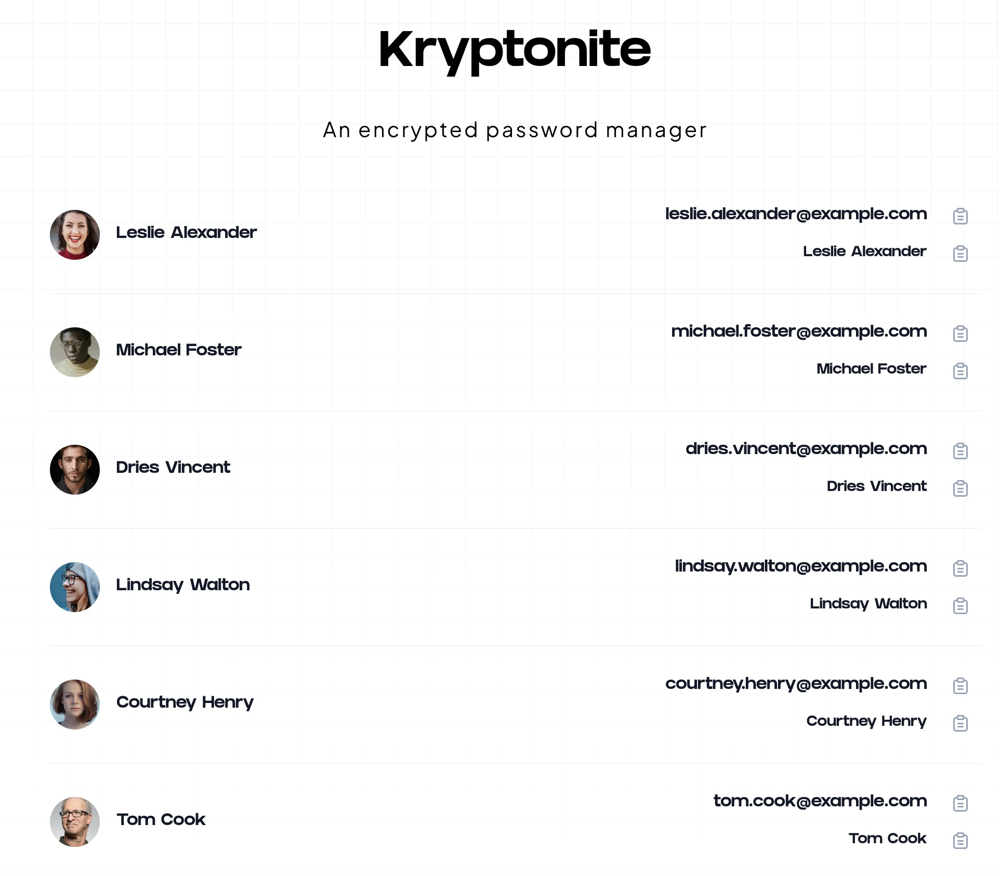

## Overview

Every single time I want to login on a site that I use only sometimes, I have to click on `Forgot Password` and then create a new one as its tough to keep track of all these ones.

**Kryptonite** is an encrypted personal password manager that helps you track all the usernames and passwords for websites in one place. You can add them manually/edit them whenever and access them wherever you want.



## Getting Started

First, run the development server:

```bash
npm install

npm run dev
```

Open [http://localhost:3000](http://localhost:3000) with your browser to see the result.

## Key Features

- Add a new website password manually to track
- Edit an existing password
- Persists login on the browser to prevent extra authentication
- Safely encrypts all the passwords in the DB
